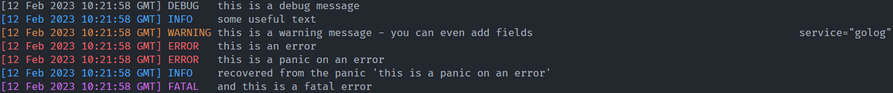

# golog 

[](https://godoc.org/skifli/golog)
[](https://goreportcard.com/report/github.com/skifli/golog)


- [golog](#golog)
  - [Installation](#installation)
  - [Documentation](#documentation)

[](examples/simple_example.go)

**golog** implements a logging infrastructure for Go. It focuses on performance, while providing a simple API.

## Installation

**golog** can be installed by using *go get*:

```
go get github.com/skifli/golog
```

After this command has been run, **golog** is ready to use. You can find the source code of your installation in:

```
$GOPATH/src/pkg/mod/github.com/skifli/golog@VERSION_INSTALLED
```

You can use **`go get -u`** to update the package.

## Documentation

See the [godoc reference](https://pkg.go.dev/github.com/skifli/golog), or run:

```
godoc -http localhost:6060
```

and navigate to [http://localhost:6060/pkg/github.com/skifli/golog/](http://localhost:6060/pkg/github.com/skifli/golog/).